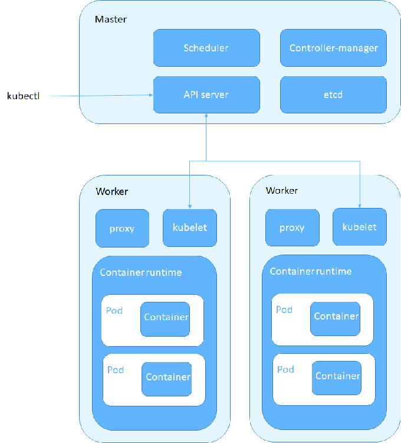

# Kubernetes


## Introduction

Kubernetes (K8s) est une plateforme open-source permettant l'automatisation du déploiement, de la mise à l'échelle et de la gestion des applications conteneurisées. Kubernetes est idéal pour des systèmes distribués où plusieurs services et applications conteneurisées doivent interagir, souvent dans des environnements de production à grande échelle. Il apporte une gestion dynamique des ressources et une haute disponibilité en optimisant les ressources et en assurant un équilibre de charge.
Quand Kubernetes est-il le bon choix par rapport à Docker-Compose ?

- Scalabilité : Kubernetes permet de mettre facilement à l'échelle des applications conteneurisées, ce qui devient plus difficile à gérer avec Docker-Compose en raison de ses limitations en matière d'orchestration.
- Résilience et Haute Disponibilité : Kubernetes détecte les échecs et redémarre automatiquement les conteneurs défectueux, offrant une fiabilité accrue.
- Gestion des ressources : Kubernetes est conçu pour gérer des clusters de serveurs, contrairement à Docker-Compose, qui est idéal pour orchestrer des applications locales ou de petite échelle.
- Mise à jour continue (rolling updates) : Kubernetes permet des mises à jour sans interruption de service, en remplaçant les conteneurs de manière progressive et contrôlée.
- Orchestration avancée : Kubernetes offre des fonctionnalités telles que la découverte de services, la gestion des volumes et le scaling horizontal de manière native.

## Architecture simplifiée de Kubernetes



Kubernetes utilise une architecture client-serveur, où les composants principaux sont le cluster et les nodes (nœuds). Voici les éléments fonctionnels clés :

#### Master Node (ou Control Plane):
- API Server : Interface principale permettant aux utilisateurs et aux outils d’interagir avec Kubernetes (interpreteur des commandes clientes).
- Scheduler : Planifie les pods sur les différents nodes en fonction des ressources.
- Controller Manager : Assure l’exécution des contrôleurs (par exemple, contrôleur de réplication).
- Etcd : Base de données clé-valeur où Kubernetes stocke toutes les données du cluster(pods, nemespaces, services, conteneurs ... crées).

#### Worker Nodes :
- Kubelet : Gère les pods sur chaque nœud.
- Kube-proxy : Gère le réseau du cluster en assurant la redirection du trafic vers les bons pods.
- Container Runtime : Environnement d'exécution (comme Docker ou containerd) où les conteneurs s'exécutent.

#### Les composants fonctionnels incluent :

- Pods : Unité de base de déploiement qui contient un ou plusieurs conteneurs.
- Namespaces : Permettent d'isoler les ressources au sein du cluster.
- Nodes : Machines (physiques ou virtuelles) où s’exécutent les pods.
- Services : Créent des points d’accès réseau pour les applications.
- Deployments : Définissent la gestion du cycle de vie des pods, notamment pour la mise à l'échelle et les mises à jour.


## Installation

### Installation via kubeadm (celle de producion)


#### Pré-requis

- Système d'exploitation : Linux (Ubuntu ou CentOS) ou Windows Server.
- Accès root/sudo sur chaque machine.
- Outils nécessaires : kubectl, kubeadm, kubelet, et un runtime conteneur (Docker ou containerd).

- Étapes d'installation

- Installer Docker (ou un autre container runtime) sur chaque machine du cluster.

```bash
sudo apt update
sudo apt install -y docker.io
sudo systemctl enable docker
sudo systemctl start docker
```
- Installer les composants Kubernetes (kubectl, kubeadm, kubelet)

```bash
sudo apt update
sudo apt install -y apt-transport-https ca-certificates curl
sudo curl -fsSLo /usr/share/keyrings/kubernetes-archive-keyring.gpg https://packages.cloud.google.com/apt/doc/apt-key.gpg
echo "deb [signed-by=/usr/share/keyrings/kubernetes-archive-keyring.gpg] https://apt.kubernetes.io/ kubernetes-xenial main" | sudo tee /etc/apt/sources.list.d/kubernetes.list
sudo apt update
sudo apt install -y kubelet kubeadm kubectl
sudo apt-mark hold kubelet kubeadm kubectl
```

- Initialiser le cluster (sur le master node uniquement)

```bash
sudo kubeadm init --pod-network-cidr=10.244.0.0/16
```
- Configurer kubectl

```bash
mkdir -p $HOME/.kube
sudo cp -i /etc/kubernetes/admin.conf $HOME/.kube/config
sudo chown $(id -u):$(id -g) $HOME/.kube/config
```

- Installer un plugin réseau (par exemple Flannel)

```bash
kubectl apply -f https://raw.githubusercontent.com/coreos/flannel/master/Documentation/kube-flannel.yml
```
Ajouter des nœuds de travail (sur chaque worker node) Rejoindre le cluster à l’aide de la commande join fournie lors de l’initialisation.


- Remarque : Arrêter et redémarrer les services Kubernetes

Vous pouvez arrêter temporairement le cluster en arrêtant les services kubelet et containerd (ou docker, selon votre runtime de conteneurs) sur le nœud maître.


- Pour arrêter le cluster :

```bash
sudo systemctl stop kubelet
sudo systemctl stop containerd   # ou sudo systemctl stop docker
```

- Pour redémarrer le cluster :

```bash
sudo systemctl start kubelet
sudo systemctl start containerd   # ou sudo systemctl start docker
```

Ces commandes arrêteront et redémarreront l’instance Kubernetes en cours d’exécution. Notez que les pods et autres ressources ne seront plus disponibles tant que kubelet et le runtime de conteneurs ne seront pas relancés.

### Installation via minikube (pour du dev)


- Installation de Kubectl :

```bash
curl -LO "https://storage.googleapis.com/kubernetes-release/release/$(curl -s https://storage.googleapis.com/kubernetes-release/release/stable.txt)/bin/linux/amd64/kubectl"
chmod +x kubectl
sudo mv kubectl /usr/local/bin/
```

- Installer Minikube :

```bash
# Sur Linux (exemple avec Ubuntu)
curl -Lo minikube https://storage.googleapis.com/minikube/releases/latest/minikube-linux-amd64
chmod +x minikube
sudo mv minikube /usr/local/bin/
```

Démarrer le Cluster avec Minikube :

Lancer Minikube :
```bash
minikube start --driver=docker
```

- Remarque : --driver=docker utilise Docker comme pilote pour exécuter Minikube dans un conteneur. Vous pouvez également utiliser virtualbox, vmware, etc., si Docker n'est pas disponible.

- Vérifier l’état du cluster :

```bash
minikube status
```

3. Commandes d’Administration de Base

- Afficher les informations du cluster :

```bash
kubectl cluster-info
```

- Vérifier les configurations de Minikube :

```bash
minikube config view
```

- Arrêter Minikube (arrête tous les services Kubernetes) :

```bash
minikube stop
```

- Redémarrer Minikube :

```bash
minikube start
```

- Supprimer complètement le cluster Minikube (utile si vous souhaitez réinitialiser l’environnement) :

```bash
minikube delete
```

- Ouvrir le tableau de bord Kubernetes dans le navigateur :

```bash
minikube dashboard
```

- Obtenir l’IP du cluster Minikube (utile pour accéder aux services) :

```bash
minikube ip
```

- Remarques Importantes :

Espace Disque et RAM : Assurez-vous que votre machine dispose de suffisamment de ressources pour exécuter Minikube.
Isolation : Minikube est recommandé pour les environnements de développement local ; il n’est pas destiné aux environnements de production.
Accès aux Pods et Services : Par défaut, Minikube crée des clusters Kubernetes à nœud unique. Tous les services sont accessibles via l’IP Minikube ou le port NodePort.

En utilisant Minikube, vous disposez d’un cluster Kubernetes fonctionnel en local, facile à gérer et prêt pour expérimenter des déploiements, configurations et développements Kubernetes sans complexité de configuration initiale.

### Notions

- Pods : Les unités de déploiement qui contiennent les conteneurs.
- Namespaces : Facilitent la gestion des ressources et permettent l'isolation au sein du cluster.
- Deployments : Gèrent les mises à jour des pods et permettent de définir le nombre de répliques.
- Services : Offrent un point d'accès réseau stable aux pods.
- ConfigMaps et Secrets : Permettent de gérer les configurations et les informations sensibles.
- Volumes : Fournissent un espace de stockage persistant pour les conteneurs.

### Commandes d'administration de base


- Commande sur les nodes

```bash
# Afficher tous les nœuds du cluster
kubectl get nodes

# Afficher les informations détaillées d’un nœud spécifique
kubectl describe node <node-name>

# Marquer un nœud comme indisponible (Drain)
kubectl drain <node-name> --ignore-daemonsets

# Ramener un nœud dans le cluster après un drain
kubectl uncordon <node-name>

# Marquer un nœud comme indisponible sans le drainer (Cordon)
kubectl cordon <node-name>

# Supprimer un nœud du cluster
kubectl delete node <node-name>
```

- Commande sur les namespaces

```bash
# Afficher tous les namespaces
kubectl get namespaces

# Créer un nouveau namespace
kubectl create namespace <namespace-name>

# Supprimer un namespace
kubectl delete namespace <namespace-name>

# Afficher tous les pods dans un namespace spécifique
kubectl get pods -n <namespace-name>

# Changer de namespace pour une commande unique
kubectl --namespace=<namespace-name> <command>

# Configurer le namespace par défaut pour kubectl
kubectl config set-context --current --namespace=<namespace-name>
```

- Commande sur les pods

```bash
# Afficher tous les pods dans le namespace actuel
kubectl get pods

# Afficher tous les pods dans tous les namespaces
kubectl get pods --all-namespaces

# Décrire un pod spécifique
kubectl describe pod <pod-name>

# Supprimer un pod
kubectl delete pod <pod-name>

# Créer un pod à partir d’un fichier YAML
kubectl apply -f <file.yaml>

# Récupérer les logs d’un pod
kubectl logs <pod-name>

# Récupérer les logs d’un conteneur spécifique dans un pod
kubectl logs <pod-name> -c <container-name>

# Lancer une commande dans un pod en cours d'exécution
kubectl exec -it <pod-name> -- <command>

# Mettre à jour un pod sans interruption (Rolling Update)
kubectl rollout restart deployment <deployment-name>
```

- Commande sur les service

```bash
# Afficher tous les services dans le namespace actuel
kubectl get services

# Afficher tous les services dans tous les namespaces
kubectl get services --all-namespaces

# Décrire un service spécifique
kubectl describe service <service-name>

# Créer un service à partir d’un fichier YAML
kubectl apply -f <service.yaml>

# Supprimer un service
kubectl delete service <service-name>

# Exposer un déploiement en tant que service (par exemple, pour l'accès externe)
kubectl expose deployment <deployment-name> --type=LoadBalancer --name=<service-name>

# Afficher les endpoints associés à un service
kubectl get endpoints <service-name>
```

- Commande sur les volumes

```bash
# Afficher les PersistentVolume (PV) disponibles
kubectl get pv

# Afficher les PersistentVolumeClaims (PVC) dans le namespace actuel
kubectl get pvc

# Décrire un PersistentVolumeClaim
kubectl describe pvc <pvc-name>

# Créer un volume ou PersistentVolumeClaim à partir d’un fichier YAML
kubectl apply -f <volume.yaml>

# Supprimer un PersistentVolumeClaim
kubectl delete pvc <pvc-name>

# Vérifier l'état d'un PersistentVolume
kubectl describe pv <pv-name>
```

- Commande sur les deployments

```bash
# Afficher tous les déploiements dans le namespace actuel
kubectl get deployments

# Afficher tous les déploiements dans tous les namespaces
kubectl get deployments --all-namespaces

# Décrire un déploiement spécifique
kubectl describe deployment <deployment-name>

# Créer un déploiement à partir d’un fichier YAML
kubectl apply -f <deployment.yaml>

# Mettre à jour un déploiement (par exemple, mise à jour d'image dans le fichier YAML)
kubectl apply -f <deployment.yaml>

# Supprimer un déploiement
kubectl delete deployment <deployment-name>

# Mettre à l'échelle un déploiement pour augmenter ou diminuer le nombre de réplicas
kubectl scale deployment <deployment-name> --replicas=<number>

# Obtenir l’historique de révision d'un déploiement
kubectl rollout history deployment <deployment-name>

# Annuler la dernière mise à jour d'un déploiement (rollback)
kubectl rollout undo deployment <deployment-name>

# Redémarrer un déploiement (Rolling restart pour appliquer des mises à jour sans interruptions)
kubectl rollout restart deployment <deployment-name>

# Afficher le statut de progression d'un déploiement
kubectl rollout status deployment <deployment-name>
```

## Les Ressources de K8S

On peut définir les ressources de Kubernetes comme des "objets".

En effet, dans Kubernetes, chaque ressource est un objet qui représente l'état souhaité pour une partie du système (comme un pod, un service, ou un volume). Ces objets décrivent des spécifications que le cluster Kubernetes utilise pour créer, gérer et maintenir les composants nécessaires à l’application.

#### Ressources de base

- Pod : Unité de base dans Kubernetes, qui représente un ou plusieurs conteneurs partageant le même réseau et les mêmes volumes.
- Service : Expose un groupe de pods sur un réseau, permettant une communication stable entre les composants d’une application.
- Namespace : Permet de diviser les ressources d’un cluster Kubernetes en environnements isolés.

#### Gestion de la charge de travail (Workloads)

- Deployment : Gère le déploiement et la mise à jour d'un groupe de pods répliqués, idéal pour les applications stateless.
- ReplicaSet : Assure un nombre défini de pods identiques pour maintenir une haute disponibilité.
- StatefulSet : Gère le déploiement et le scaling de pods ayant un état persistant, utilisé pour les applications qui nécessitent une identité stable (bases de données, etc.).
- DaemonSet : Assure que chaque nœud exécute un pod spécifique, souvent utilisé pour la collecte de logs ou la surveillance.
- Job : Exécute une tâche unique jusqu'à sa réussite, puis se termine. Utilisé pour des tâches ponctuelles.
- CronJob : Planifie des tâches répétitives sur une base horaire, similaire à un cron Linux.
- ReplicationController : Ancienne version de ReplicaSet, assure un nombre spécifique de réplicas pour des pods.

#### Configuration et gestion des données

- ConfigMap : Stocke des configurations sous forme de paires clé-valeur, utilisables par les pods.
- Secret : Stocke des informations sensibles, comme des mots de passe, de manière sécurisée.
- PersistentVolume (PV) : Représente un espace de stockage persistant dans le cluster.
- PersistentVolumeClaim (PVC) : Demande un espace de stockage (PV) pour une application, permettant aux pods d’utiliser des volumes persistants.
- Volume : Définit un type de stockage temporaire ou persistant pour les pods.

#### Réseau

- Ingress : Gère l’accès externe au cluster et le routage HTTP/HTTPS vers des services internes.
- NetworkPolicy : Définit des règles de réseau pour contrôler le trafic entre les pods.

#### Sécurité et gestion des accès

- ServiceAccount : Associe une identité spécifique aux pods pour accéder aux ressources de l'API.
- Role et ClusterRole : Définissent des autorisations sur des ressources Kubernetes au sein d'un namespace (Role) ou sur tout le cluster (ClusterRole).
- RoleBinding et ClusterRoleBinding : Lient les rôles aux utilisateurs, groupes ou comptes de service, permettant de contrôler les autorisations dans le cluster.

#### Autres ressources

- Endpoint : Définit les adresses IP ou noms DNS d’un groupe de pods pour les services, permettant le routage.
- HorizontalPodAutoscaler : Gère le scaling automatique des pods en fonction de l’utilisation des ressources (CPU, mémoire, etc.).
- Node : Représente un nœud du cluster, tel qu'une VM ou une machine physique, sur lequel les pods sont exécutés.
- LimitRange : Définit des limites de ressources pour les pods dans un namespace.
- ResourceQuota : Implique des restrictions sur la quantité de ressources utilisables dans un namespace.


## Fichiers de configuration de quelques ressources

#### Fichier de conf de deployement
Un fichier de déploiement Kubernetes définit les ressources nécessaires pour gérer une application. Cela inclut la configuration des pods, des réplicas, de l’image Docker, des volumes, et bien plus encore.
##### Structure du fichier
````yaml
apiVersion: apps/v1
kind: Deployment
metadata:
  name: nom-de-deploiement
  labels:
    app: mon-application
spec:
  replicas: 3
  selector:
    matchLabels:
      app: mon-application
  template:
    metadata:
      labels:
        app: mon-application
    spec:
      containers:
      - name: mon-conteneur
        image: mon-image:1.0
        ports:
        - containerPort: 80
        env:
        - name: ENV_VAR
          value: "production"
        resources:
          requests:
            memory: "64Mi"
            cpu: "250m"
          limits:
            memory: "128Mi"
            cpu: "500m"
        volumeMounts:
        - mountPath: /donnees
          name: stockage
      volumes:
      - name: stockage
        emptyDir: {}
````
##### Explications du fichier

Fichier de configuration de déploiement Kubernetes

Ce fichier définit et configure un déploiement Kubernetes en précisant comment les ressources d’application doivent être gérées, y compris les pods, réplicas, et les conteneurs associés.
Structure et explication du fichier

- apiVersion :
Indique la version de l'API Kubernetes utilisée pour ce fichier de déploiement.

- kind :
Spécifie le type de ressource Kubernetes, ici Deployment, qui permet de gérer et de maintenir des pods répliqués.

- metadata :
Contient les métadonnées pour identifier le déploiement, telles que le nom et les étiquettes (labels) permettant de catégoriser ou d'organiser la ressource.

- spec :
Décrit la configuration spécifique pour le déploiement, en définissant des paramètres comme le nombre de réplicas et le modèle de pod.

- s- pec.replicas :
Indique le nombre d’instances du pod à déployer pour garantir la disponibilité.

- spec.selector :
Définit les critères d’étiquettes (labels) pour sélectionner et associer les pods à ce déploiement. Il permet de contrôler précisément quels pods le déploiement doit gérer.

- template :
Fournit le modèle pour chaque pod créé par le déploiement, en spécifiant ses métadonnées et sa configuration.

- template.metadata :
Contient les métadonnées du pod, y compris les étiquettes (labels) permettant de l'identifier et de le distinguer des autres pods.

- template.spec :
Définit la configuration des conteneurs exécutés dans chaque pod, y compris l'image Docker à utiliser et les variables d’environnement.

- containers :
Liste les conteneurs à exécuter dans le pod. Chaque conteneur est configuré avec des propriétés comme le nom, l’image Docker, et les ports exposés.

- containers.image :
Définit l’image Docker utilisée pour le conteneur, permettant de spécifier la version exacte du logiciel.

- containers.ports :
Définit les ports que le conteneur expose pour interagir avec d’autres services ou applications.

- containers.env :
Configure les variables d'environnement nécessaires au conteneur, comme des paramètres de configuration spécifiques à l’environnement.

- resources :
Gère les ressources assignées au conteneur, en définissant les besoins en CPU et en mémoire pour optimiser la stabilité et la performance.

- volumeMounts :
Définit où et comment les volumes sont montés dans le conteneur pour gérer des données persistantes ou partagées.

- volumes :
Spécifie les volumes à utiliser dans le pod. Ceux-ci peuvent servir de stockage temporaire ou persistant, accessible par les conteneurs.


---
**NOTE**

Bien que les trois labels soient identiques ici (app: mon-application), ils n’ont pas besoin d’avoir le même nom dans tous les cas. Cependant, pour que le déploiement gère correctement les pods, il est nécessaire que le label défini dans `spec.selector.matchLabels` corresponde exactement à celui dans `template.metadata.labels`. Le label au niveau du Deployment (metadata.labels) peut être différent, car il est utilisé pour catégoriser le déploiement lui-même et n’affecte pas la sélection des pods.

En effet, le label du `template.metadata.labels`, celui que portera tous les pods du deploiement afin de pouvoir se faire identifier, et la section `spec.selector.matchLabels` , permet alors au deploiement de selectionner ces pods qui sont ne sont que ses pods (à lui).
Le label de la section du `metadata` du deploiment est juste un label pour pouvoir identifier le deploiemnt lui-meme(pour des recherches et autres), il n'a pas de lien avec les autres.

---

#### Fichier de conf de service
Un fichier de configuration de service Kubernetes permet d’exposer un ensemble de pods sur le réseau, interne ou externe, en assurant la communication stable entre les différents composants d’une application.
##### Structure du fichier
```yaml
apiVersion: v1
kind: Service
metadata:
  name: mon-service
  labels:
    app: mon-application
spec:
  selector:
    app: mon-application
  ports:
    - protocol: TCP
      port: 80
      targetPort: 8080
  type: ClusterIP
  ```

##### Explications du fichier
- apiVersion :
Indique la version de l'API Kubernetes pour ce type de ressource, ici v1, qui est utilisé pour la configuration des services.

- kind :
Spécifie le type de ressource Kubernetes, ici Service. Ce type de ressource crée un service réseau pour exposer les pods aux autres services ou à l’extérieur du cluster.

- metadata :
Fournit des métadonnées pour le service, incluant name, qui identifie le service, et labels pour organiser ou classifier le service dans Kubernetes.

- spec :
Contient les spécifications du service, c’est-à-dire les paramètres nécessaires pour sa configuration.

- spec.selector :
Définit les labels que Kubernetes utilise pour sélectionner les pods à associer à ce service. Ici, les pods ayant le label app: mon-application seront associés au service. Ce sélecteur garantit que le trafic envoyé au service est dirigé vers les pods correspondants.

- spec.ports :
Déclare la liste des ports sur lesquels le service est accessible. Chaque port expose le service à un certain niveau du réseau et redirige le trafic vers les pods ciblés.

- protocol : Spécifie le protocole de communication, ici TCP, utilisé pour la transmission des données.
- port : Indique le port sur lequel le service est exposé aux clients du réseau interne.
- targetPort : Correspond au port du conteneur cible dans chaque pod vers lequel le trafic doit être dirigé. Cela permet de faire correspondre le port externe et le port de l’application dans le conteneur.

- type :
Définit la portée d’accessibilité du service dans le cluster. Ici, ClusterIP expose le service uniquement dans le cluster, permettant une communication interne entre services. Les autres valeurs possibles incluent NodePort (exposition à l’extérieur via un port de nœud) et LoadBalancer (exposition externe avec une adresse IP publique via un load balancer).


## PRATICAL CASE : HELLOWORD DEPLOYMENT ON GKE

At this stage, the cluster GKE is already created and is running successfully.

<strong> How to deploy a simple app on the cluster and make it acceible via https by clients?</strong>

### Architecture

There is lots of possible architecuture in making app accessible via https by client.
see this [this article](https://www.sfeir.dev/cloud/comprendre-kubernetes-ingress-plongee-dans-le-vrai-load-balancer-demo-minikube/) .
Here we will use Ingress as soluion to make the app accessible vai https.

<strong>The are two type of Ingress in cloud context :</strong>
- Ingress based on a web server like NGINX
- Ingress based on a Load-balancer on a cloud, managed by the cloud provider

#### Implementation with the Ingress based on cloud Load-balancer

We have performed the following actions :

- Reserved a `static ip adress` in gke for the Ingress
Here i have already donne this, in my project, i had to be carefull with the type of the ip wich could be global or regional.
According to the what had been chosen, an annotation on the `Ingress file` should be updated to match the type of the ip addr.

- Register a `dns-names` pointing to the static ip adress
We need a dn-name to ask for a managed certificate.

- Config a k8s ressource file for `ManagedCertificate` that can be done directly in gke
This can be donne directly in gke console or with gke api. But here i have used k8s ressource file to performe this action.
```yaml
---
# Certificate managed by GKE
apiVersion: networking.gke.io/v1
kind: ManagedCertificate
metadata:
  name: managed-cert
spec:
  domains:
    - web.kone-wolouho-oumar.com
    - prod.kone-wolouho-oumar.com
```
- Config a k8s ressource file for `FrontendConfig` to redirect http to https
```yaml
---
# Config use by ingress to redirect http to https
apiVersion: networking.gke.io/v1beta1
kind: FrontendConfig
metadata:
  name: http-to-https
spec:
  redirectToHttps:
    enabled: true
    responseCodeName: MOVED_PERMANENTLY_DEFAULT
```
- Config a k8s ressource file for `Ingress` to define the proxy redirection rule to differents app
```yaml

---
# Ingress ressource using GCE ingress-controller
apiVersion: networking.k8s.io/v1
kind: Ingress
metadata:
  name: my-ingress
  annotations:
    # If the class annotation is not specified it defaults to "gce".
    spec.ingressClassName: "gce"
    kubernetes.io/ingress.global-static-ip-name: "wke-cluster-static-ip-addr"
    networking.gke.io/managed-certificates: managed-cert
    networking.gke.io/v1beta1.FrontendConfig: "http-to-https"
spec:
  rules:
  - host: web.kone-wolouho-oumar.com
    http:
      paths:
      - path: /wke-web-site
        pathType: Prefix
        backend:
          service:
            name: wke-web-site-service
            port:
              number: 5000


  # - host: prod.kone-wolouho-oumar.com
  #   http:
  #     paths:
  #     - path: /*
  #       pathType: ImplementationSpecific
  #       backend:
  #         service:
  #           name: proverbs-app-service
  #           port:
  #             number: 5000
```
- Config a k8s ressource file for `deployment` to run the app on a pod or set of pods
```yaml
---
# Deployment YAML
apiVersion: apps/v1
kind: Deployment
metadata:
  name: wke-web-site-deployment
  labels:
    app: wke-web-site
spec:
  replicas: 1
  selector:
    matchLabels:
      app: wke-web-site
  template:
    metadata:
      labels:
        app: wke-web-site
    spec:
      containers:
      - name: wke-web-site
        image: konewoumar/wke-web-site:1.0.0
        ports:
        - containerPort: 5000
        resources:
          requests:
            memory: "128Mi"
          limits:
            memory: "128Mi"
```
- Config a k8s ressource file for `Service` to expose the app on the cluster
```yaml
---
# Service YAML
apiVersion: v1
kind: Service
metadata:
  name: wke-web-site-service
spec:
  selector:
    app: wke-web-site
  ports:
    - protocol: TCP
      port: 5000
      targetPort: 5000
  type: ClusterIP
```

- Update the compute `helthcheck` of the service [here in GKE](https://console.cloud.google.com/compute/healthChecks)

The default helthcheck path of the back-end (back-end = a service used by Ingress) is set to "/", if your app serve under un subpath, you should update this helthcheck path with the subpath of your app.